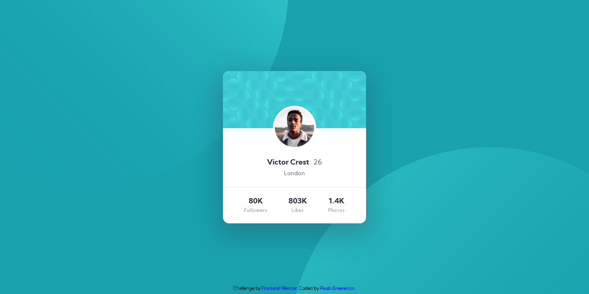

# Frontend Mentor - Profile card component solution

This is a solution to the [Profile card component challenge on Frontend Mentor](https://www.frontendmentor.io/challenges/profile-card-component-cfArpWshJ). Frontend Mentor challenges help you improve your coding skills by building realistic projects. 

## Table of contents

- [Overview](#overview)
  - [The challenge](#the-challenge)
  - [Screenshots](#screenshot)
  - [Links](#links)
- [My process](#my-process)
  - [Built with](#built-with)
  - [What I learned](#what-i-learned)
  - [Continued development](#continued-development)
  - [Useful resources](#useful-resources)
- [Author](#author)
- [Acknowledgments](#acknowledgments)

## Overview

### The challenge

- Build out the project to the designs provided

### Screenshots




### Links

- Solution URL: [Click to see my solution working!](https://paulo-emerencio.github.io/profile-card-component/)
- Live Site URL: [I don't have a site yet, so here is my youtube channel](https://www.youtube.com/c/RockcomLegendas)

## My process

### Built with

- Semantic HTML5 markup
- Scss
- Flexbox
- Mobile-first workflow

### What I learned

I was forced to learn all I could about css background property, to be able of positioning the two balls correctly in the background.

```scss
main {
   @include flex-center;
   min-height: 100vh;
   background-color: $primary-color;
   background-image:
      url("../images/bg-pattern-top.svg"),
      url("../images/bg-pattern-bottom.svg");
   background-size: 100vh;
   background-position:
      bottom 50vh right 50vw, top 50vh left 50vw;
   background-repeat: no-repeat;

   @include responsive(min-width, 740px) {
      background-size: auto;
      background-position:
         bottom 37vh right 51vw, top 50vh left 49vw;
   }
}
```
### Continued development

I think it's time for me to learn some javascript library. (Note: I already learned vanilla javascript)

### Useful resources

- [Controlling background-images | CSS Tutorial](https://www.youtube.com/watch?v=3T_Jy1CqH9k) - This video helped me manipulate the css background property.

## Author

- Frontend Mentor - [@Paulo-Emerencio](https://www.frontendmentor.io/profile/Paulo-Emerencio)
- Digital Innovation One - [@p_emerencio](https://web.digitalinnovation.one/users/p_emerencio?tab=achievements)

## Acknowledgments

Once again [Kevin Powell](https://www.youtube.com/kepowob) helped me a lot, the best css teacher out there!
